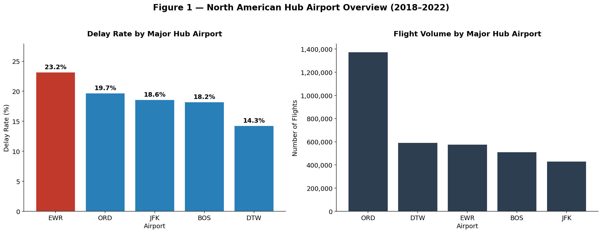
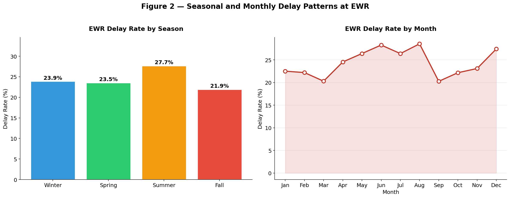
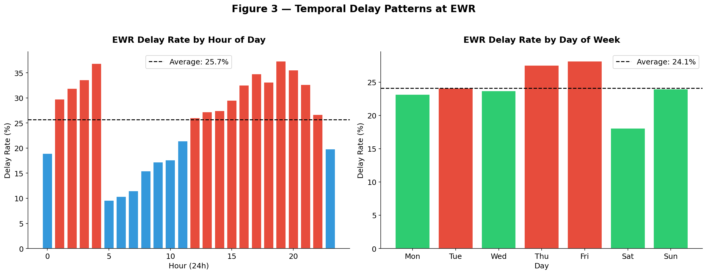
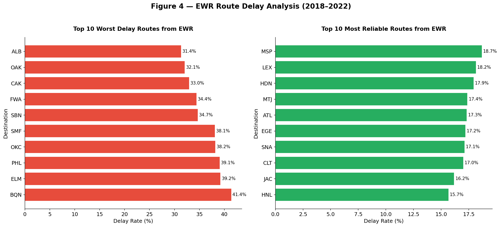
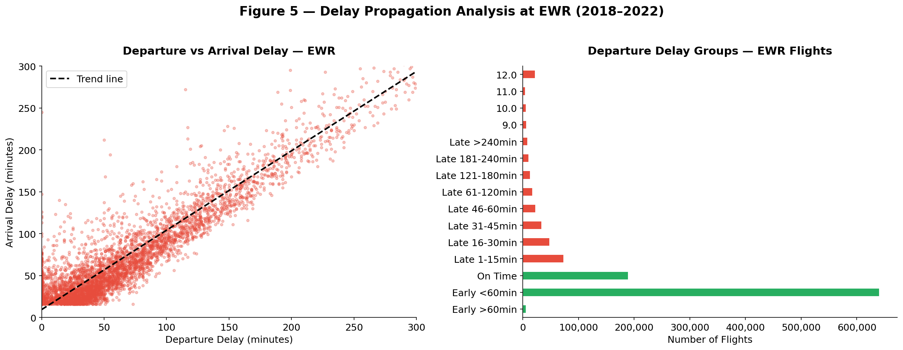
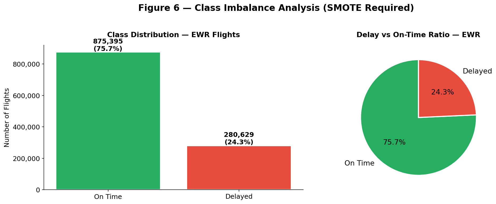
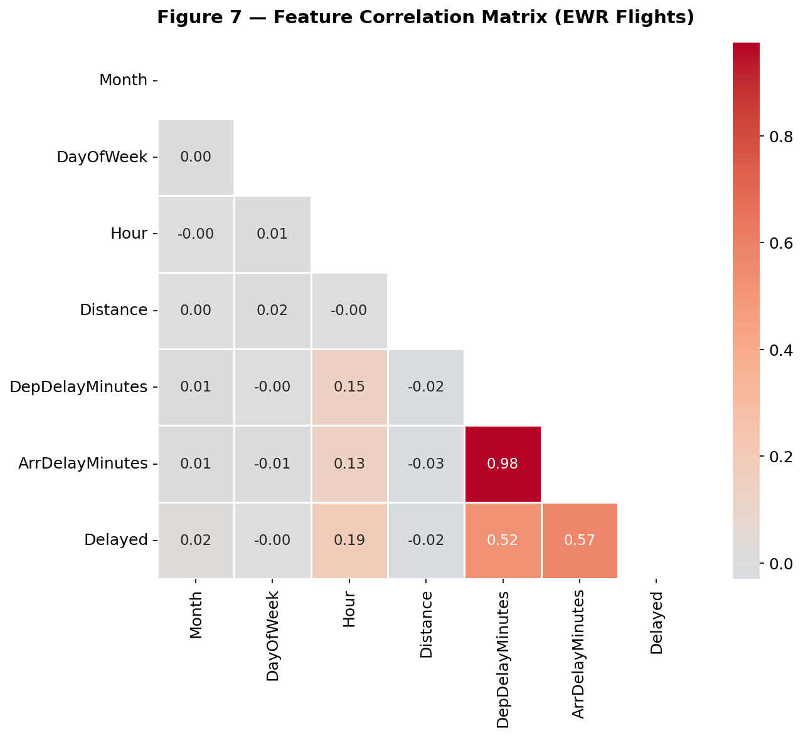

# Flight Delay EDA — North American Hub Airports (2018–2022)


> **Exploratory Data Analysis of 29 million flights across 5 major North American hub airports — identifying key delay patterns, seasonal trends, and peak risk periods.**

---

## 📋 Project Overview

This project performs a comprehensive **Exploratory Data Analysis (EDA)** on flight delay data from the Bureau of Transportation Statistics (BTS), covering **29,193,782 flights** between 2018 and 2022.

The analysis focuses on **5 major North American hub airports**:

| Airport | Code | Delay Rate |
|---------|------|-----------|
| Newark Liberty International | EWR | 23.2% 🔴 |
| O'Hare International | ORD | 19.7% |
| John F. Kennedy International | JFK | 18.6% |
| Boston Logan International | BOS | 18.2% |
| Detroit Metropolitan | DTW | 14.3% ✅ |

**Key Finding:** EWR has the highest delay rate at 23.2% — nearly 10 percentage points above the best-performing hub (DTW at 14.3%).

---

## 🎯 Objectives

- Analyze delay patterns across 5 major hub airports over 5 years
- Identify seasonal, monthly, and hourly delay trends at EWR
- Map the best and worst performing routes from EWR
- Quantify class imbalance for Phase 2 ML modeling
- Deliver actionable insights relevant to aviation operations

---

## 📊 Key Findings

### Delay Rates
- **EWR** is the worst performing hub with a **23.2% delay rate**
- **DTW** is the most reliable hub at **14.3%**
- Overall delay rate across all 5 hubs: **~20%**

### Seasonal Patterns at EWR
- **Worst season:** Summer (27.7%) — driven by thunderstorms and high traffic volume
- **Best season:** Fall (21.9%) — most reliable travel period
- **Peak delay month:** June and August
- **Most reliable month:** March

### Temporal Patterns
- **Peak delay hour:** 19:00 (7 PM) — evening flight delays cascade from morning disruptions
- **Most reliable hour:** Early morning (06:00–07:00)
- **Worst day:** Friday — highest weekly delay rate
- **Best day:** Saturday — most reliable day to fly

### Class Imbalance
- ~77% of flights are on time, ~23% are delayed
- **SMOTE will be required** in Phase 2 to handle this imbalance

---

## 🗂️ Repository Structure

```
flight-delay-eda/
│
├── canadian_flight_delay_phase1.ipynb   # Main analysis notebook
│
├── figures/
│   ├── fig1_airport_overview.png        # Delay rate + volume by airport
│   ├── fig2_seasonal_patterns.png       # Seasonal and monthly trends
│   ├── fig3_temporal_patterns.png       # Hour and day of week analysis
│   ├── fig4_route_analysis.png          # Best and worst routes from EWR
│   ├── fig5_delay_propagation.png       # Departure vs arrival delay correlation
│   ├── fig6_class_imbalance.png         # On-time vs delayed distribution
│   └── fig7_correlation_heatmap.png     # Feature correlation matrix
│
└── README.md
```

---

## 📈 Visualizations

### Figure 1 — Airport Overview


### Figure 2 — Seasonal Patterns


### Figure 3 — Temporal Patterns


### Figure 4 — Route Analysis


### Figure 5 — Delay Propagation


### Figure 6 — Class Imbalance


### Figure 7 — Correlation Heatmap


---

## 🛠️ Tech Stack

| Tool | Purpose |
|------|---------|
| Python 3.9+ | Core language |
| Pandas | Data manipulation |
| NumPy | Numerical computing |
| Matplotlib | Visualizations |
| Seaborn | Statistical plots |
| Jupyter Notebook | Development environment |

---

## 📦 Dataset

**Source:** [Kaggle — Flight Delay Dataset 2018–2022](https://www.kaggle.com/datasets/robikscube/flight-delay-dataset-20182022)

| Year | Rows |
|------|------|
| 2018 | 5,689,512 |
| 2019 | 8,091,684 |
| 2020 | 5,022,397 |
| 2021 | 6,311,871 |
| 2022 | 4,078,318 |
| **Total** | **29,193,782** |

> **Note:** Dataset not included in this repository due to size (9GB+). Download from Kaggle link above and place parquet files in the project root directory.

---

## 🚀 How to Run

```bash
# Clone the repository
git clone https://github.com/haritesadek/flight-delay-eda.git
cd flight-delay-eda

# Install dependencies
pip install pandas numpy matplotlib seaborn jupyter pyarrow

# Launch Jupyter
jupyter notebook

# Open and run
US_FOCUS_AIRPORTS_EDA.ipynb
```

---

## 🔭 Phase 2 — Coming Soon

Phase 2 will build on this EDA with a full ML pipeline:

- Feature engineering and encoding
- SMOTE for class imbalance handling
- Model training: XGBoost, Random Forest, Logistic Regression
- Model evaluation: ROC curves, confusion matrices, precision-recall
- SHAP explainability analysis
- Identification of top delay predictors

---

## 👤 Author

**Sadek Harite**  
MBA Candidate in Business Analytics — Sprott School of Business, Carleton University  
Electronics & Computer Science Engineer

[](https://github.com/haritesadek)
[](https://contra.com/haritesadek)

---

## 📄 License

This project is licensed under the MIT License — see the [LICENSE](LICENSE) file for details.
